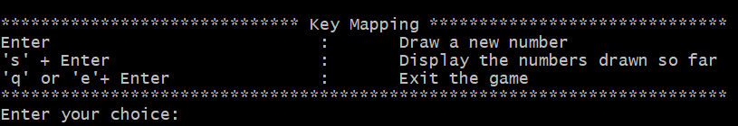
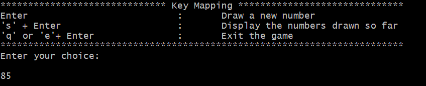
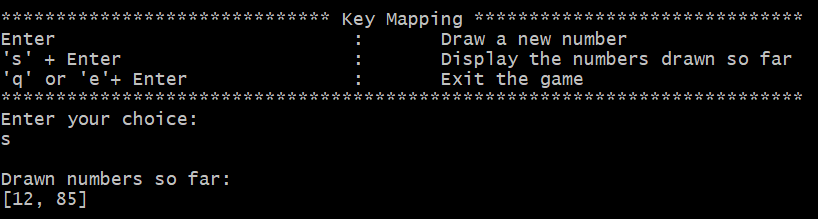
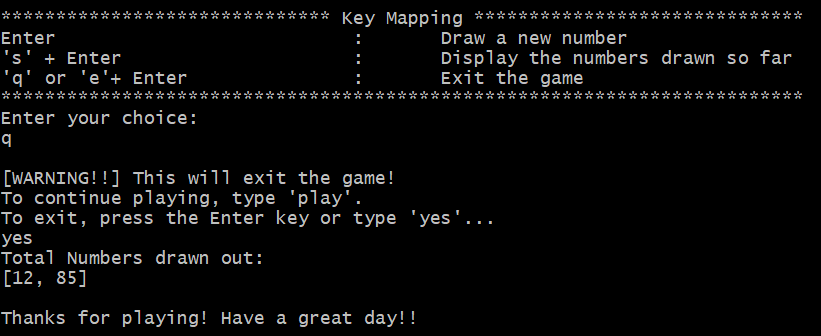
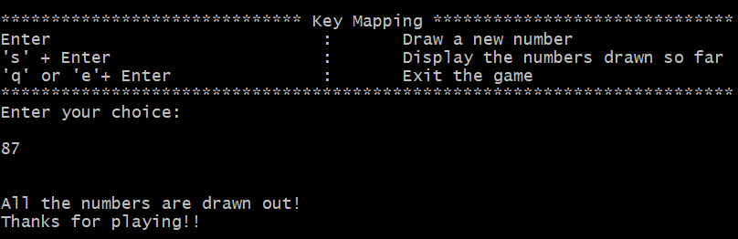

# Bingo: The Game!

## How to run:

- ***Windows***:
    ```
    python bingo.py
    ```

- ***Unix / Mac OS***:
    ```
    python3 bingo.py
    ```


## How to play:
1. You will be given a Key Map at the start of the game.<br><br>
<br><br>
2. Press the ```Enter``` key to draw out a new number.<br><br>
<br><br>
3. Press ```s``` key along with the ```Enter``` key to display the numbers that have been drawn.<br><br>
<br><br>
4. Press ```q``` or ```e``` along with the ```Enter``` key to exit. <br>
This will ask for a confirmation.<br><br>


The game ends when either all the numbers have been drawn out or the user voluntarily chooses to quit the game.<br><br>
